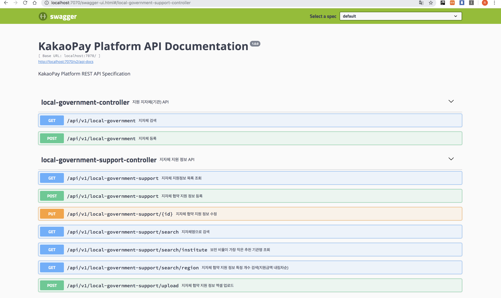

# 프로젝트명
> 지자체 협약 지원 서비스 개발


중소기업은행 지자체 협약 지원 정보 서비스 개발



## 목차
* [개발 프레임워크](#개발-프레임워크)
* [실행 방법](#실행-방법)
* [API 명세](#api-명세)
* [TODO](#todo)
* [해결 방법](#해결-방법)


## 개발 프레임워크
| Dependence  |    Version    | 
|-------------|---------------|
| java        | 1.8           |
| spring-boot | 2.1.3.RELEASE |
| jpa         |               |
| h2 databaase|               |
| lombok      |               |


## 실행 방법
```sh
> Run ApiServerApplication
```

## API 명세
```sh
http://localhost:7070/swagger-ui.html 로 접속
```

## TODO
- [x] DB 스키마 설계
- [x] API Spec 정리
- [x] H2 DB 연동 (in memory)
- [x] API 구현
    - [x] 각 레코드를 데이터베이스에 저장하는 API 개발
    - [x] 지자체 목록 검색 API
    - [x] 지원하는 지자체명을 입력 받아 해당 지자체의 지원정보를 출력하는 API 개발
    - [x] 지원하는 지자체 정보 수정 기능 API 개발
    - [x] 지원한도 컬럼에서 지원금액으로 내림차순 정렬(지원금액이 동일하면 이차보전 평균 비율이 적은 순서)하여 특정 개수만 출력하는 API 개발
    - [x] 이차보전 컬럼에서 보전 비율이 가장 작은 추천 기관명을 출력하는 API 개발
    - [ ] (옵션) 특정 기사를 분석하여 본 사용자는 어떤 지자체에서 금융지원을 받는게 가장 좋을지 지 자체명을 추천하는 API 개발
- [ ] Oauth2 + JWT 를 통한 인증 구현    
- [x] 단위 테스트를 통한 검증
- [x] README 작성

## 해결 방법
- DB 스키마 설계
    - 지자체 기관 한 개당 한 개의 지자체 지원정보를 가질 수 있다고 가정
    - 지원금액이나 이차보전은 정렬이 필요하므로 숫자형으로 데이터 저장(이차 보전은 min, max 분리)
    - 지자체 코드는 Auto increment로 설정 
    
- 각 레코드를 데이터베이스에 저장하는 API 개발
    - json data 입력받아 저장하는 API
    - excel file 업로드시 저장하는 API
    - 데이터 저장 시 입력받은 지자체명으로 지자체 기관 table 조회 후, 해당 기관이 없으면 지자체 기관 등록 후 지원 정보 등록

- 이차보전 컬럼에서 보전 비율이 가장 작은 추천 기관명을 출력하는 API 개발
    - 보전 비율이 min, max 값을 갖고 있으므로 평균 비율이 가장 작은 추천 기관명으로 출력

    
    


<!-- Markdown link & img dfn's -->
[npm-image]: https://img.shields.io/npm/v/datadog-metrics.svg?style=flat-square
[npm-url]: https://npmjs.org/package/datadog-metrics
[npm-downloads]: https://img.shields.io/npm/dm/datadog-metrics.svg?style=flat-square
[travis-image]: https://img.shields.io/travis/dbader/node-datadog-metrics/master.svg?style=flat-square
[travis-url]: https://travis-ci.org/dbader/node-datadog-metrics
[wiki]: https://github.com/yourname/yourproject/wiki